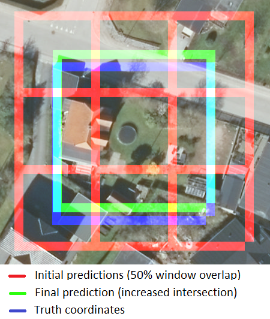

# Data Analytics II - WWU

Final project

Task II

Group 10

## Introduction

In the final part of this project, we employ techniques related to the design of convolutional neural networks in order to identify sunspots, pools, lakes, and trampolines in satellite images.

Initially, we believed that pre-trained models with satellite images would be the most suitable to develop this task. In this sense, we searched for pre-trained models on the internet and find the Satallighte library, which already had two pre-trained models with images from the EuroSat dataset, with 27000 samples divided into 10 classes: Annual Crop, Forest, Herbaceous Vegetation, Highway, Industrial, Pasture, Permanent Crop, Residential, River, SeaLake. Furthermore, these images were presented in 240x240 pixels, very close to the 256x256 format of the given images in the training dataset prepared for this task.

The chosen model, named MobileNetV2, contains about 2.2 million parameters, with several convolutional, dropout, and batch normalization layers. The Satellighte library was developed using PyTorch and its name is a mixture of the words Satellite and Lightning (from the Pytoch Lightning package).

We also used the unlabeled images to train the model. We divided these images into 256x256 windows with 50% overlap to label and use them to fit the model. The dense layers were replaced by a new one in order to fit 5 classes instead of 10. From that, the weights prior to the dense layers were frozen, so that, the weights of the dense layers were adjusted. Afterward, we unfroze all the network parameters and fine-tuned them all. After reaching convergence, we stored the model in a .pt file (exclusive to PyTorch). The procedures described were developed in Google Colab in order to have the model loaded on GPUs and reduce the processing time.

In order to make predictions on the provided validation images (8000x8000 pixels), we used windowing at 256x256 size and with 50% overlap. Finally, to determine the coordinates of a prediction, we calculate the intersection of the predictions of a single object, as shown in the image above. 

Reference to Satellighte Docs: https://satellighte.readthedocs.io/en/latest/

## Files explanation

### model.zip

This file contains the final model used to make predictions. The model is in .pt format, exclusive to PyTorch. It is necessary to have the .pt file to run the create_predictions.py file, as explained below.

### create_predictions.py

This is the .py file that receives a folder containing PNG images as input. For each PNG image, the algorithm saves a CSV file containing the coordinates of its final predictions.

As mentioned earlier, this project used the libraries Satellite and PyTorch. Therefore, one must have these packages installed to run the code. A requirements.pip file is provided containing all used libraries and their respective versions. The algorithm was tested in Python 3.8.10 and can open the model on both GPU and CPU.

Tests performed on an Intel i5 8th Generation 4-core CPU showed that an 8000x8000 image can take between 12 and 15 minutes to be predicted.

To run this algorithm, it is necessary to supply arguments on the command line in the order described below. If not provided, default values will be used. Additionally, the code contains comments that briefly explain its functions and procedures.

	Args:

		python3 predict_images.py imgs_path path_to_save_csvs path_to_model plot_predictions

		imgs_path (str): Absolute path to folder containing PNG images to be predicted. Default is the same path this python file is located.
		
		path_to_save_csvs (str): Absolute path where to save the output CSVs. Default is the same as imgs_path.
		
		path_to_model (str): Absolute path to model checkpoint (suffix .pt). Default is the same path this python file is located plus model_ckpt.pt.
		
		plot_predictions (int): Whether to plot images with predictions or not. This value must be 0 (default) or 1. Setting this arg to 1 will save PNG images in path_to_save_csvs containing blue squares around the predictions. The default was set to 0 because the task directives didn't ask for this, but it's really cool to set this to 1 to have a look at the predictions in the end.

	Exemple:

		python3 
		predict_images.py 
		/home/dimi/validation_data/02_validation_data_images/
		/home/dimi/validation_data/02_validation_data_images/csv_results/ 
		/home/dimi/DA2Group10/task_2/results/model_checkpoints/model_ckpt.pt
		1

### requirements.pip

As mentioned before, this project used the libraries Satellite and PyTorch, and it is necessary to have them installed in order to execute the predictions. This file has all the libraries used and their respective versions. We tested create_predictions.py using Python 3.8.10 running on Ubuntu 20.04.

### fine_tuning_pretrained_satellighte_model.ipynb

This is the Jupyter Notebook file used to develop the entire model training setup. The code deals with all the necessary pre-processing to work on this project: downloading and loading the pre-trained model; definition of the transformations performed on the images before passing them through the model (resize and data augmentation); definition of a Python class that inherits torch.utils.data.Dataset and builds all the structure needed to load the provided images; definition of the model hyperparameters (learning rate, momentum, optimizer, batch size, and others); checkpoints to save the best versions of the model; modification of the dense layers to adapt them to the correct amount of classes; training of the dense layers; and, finally, training all layers. It is worth mentioning that the hyperparameters were changed every round of 20 training epochs. For example, the value of learning rate was decreased each round, while batch size increased. These small changes helped the model to converge much faster.

### labeling_unlabeled_training_data.ipynb

This is the code developed to open the unlabeled images, perform the sliding window, save small 256x256 images, and then define which ones would belong to each class. Finally, the algorithm creates the folders background, ponds, solar, pool, and trampoline, in order to save the images in their respective folders. This procedure was fundamental to increasing the size of the training dataset and improving the performance of the classifier.

### predicting_validation_data.ipynb

This is the code developed to open the 8000x8000 validation images, perform the sliding window, predictions, and save images and CSVs with predictions. The code in this Jupyter Notebook is extremely similar to the create_predictions.py file.

